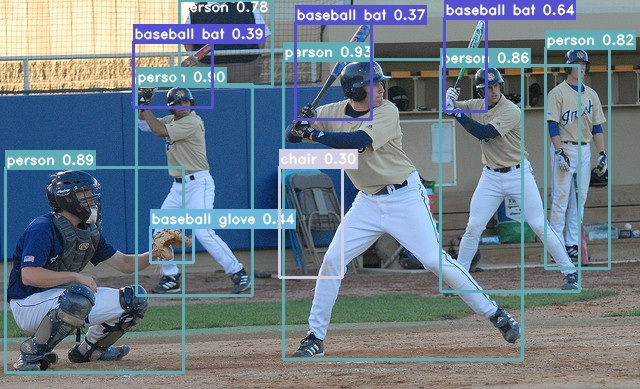
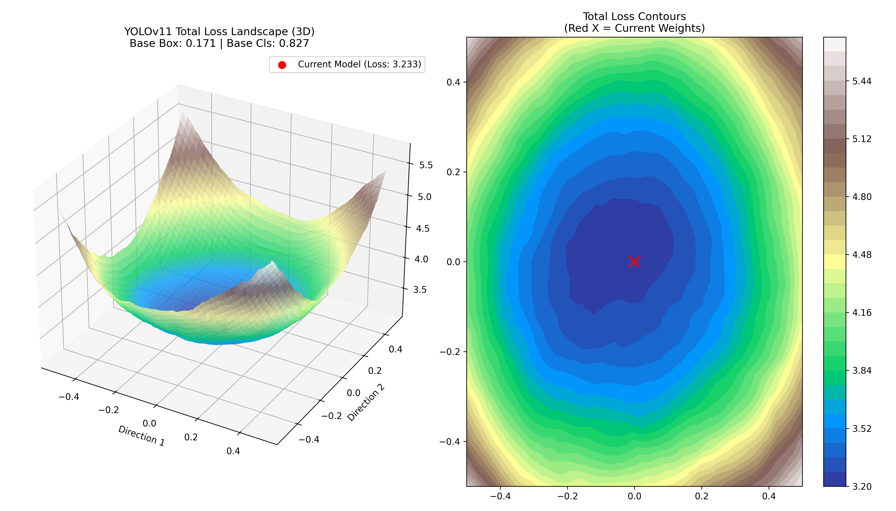
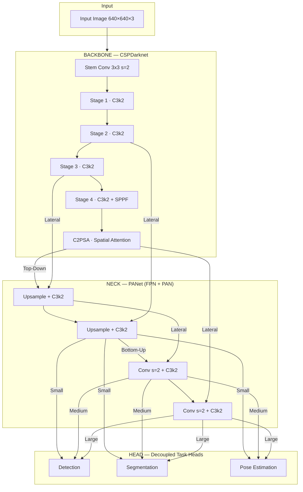

<div align="center">

# 🚀 YOLOv11 — Research-Grade PyTorch Implementation

[](https://pytorch.org/)
[](https://www.python.org/)
[](https://developer.nvidia.com/cuda-zone)
[](https://opensource.org/licenses/MIT)

**A high-performance, precision-engineered implementation of YOLOv11 built from the ground up.**  
*Optimized for speed, reliability, and interpretability in both research and production environments.*

[🎬 Video Demo](#-visual-showcase) • [✨ Key Features](#-core-capabilities) • [🛠️ Performance Engineering](#-professional-optimizations) • [🚀 Quick Start](#-installation) • [📊 Loss Landscape](#-loss-landscape-visualization)

---

</div>

## 🎬 Visual Showcase

### 📹 Real-Time Tracking & Pose Estimation

Experience zero-latency inference with integrated skeleton tracking.

<https://github.com/user-attachments/assets/c0706b07-8e98-41fe-820f-3fd9209eb861>

> **Engineered for Speed:** View real-time FPS metrics and inference latency overlays.  
> `python inference.py --weights saves/last.pt --source demo.mp4 --save output.mp4`

### 🖼️ Precision Detection Results

High-fidelity mask generation and object localization on the COCO validation set.



---

## ✨ Core Capabilities

| Category | Feature & Technology |
|:---|:---|
| **Architectural** | **C3k2 CSP** blocks for efficient feature extraction, **C2PSA** spatial attention, and a multi-scale **PANet** neck. |
| **Multi-Task** | Seamless support for **Object Detection**, **Instance Segmentation**, and **Pose Estimation** (17-keypoint skeleton). |
| **Loss Suite** | Optimized convergence using **CIoU**, **DFL** (Distribution Focal Loss), and **Wise-IoU** with **Quality Focal Loss**. |
| **Training Ops** | Advanced EMA, linear-to-cosine learning rate scheduling, progressive resizing, and early stopping. |
| **Augmentation** | Industry-standard pipeline: **Mosaic**, **MixUp**, **CutMix**, **CopyPaste**, and **LetterBox** resizing. |
| **Deployment** | Native **FP16** support, **ONNX** runtime integration, and high-speed **TensorRT** engine exports. |

---

## 🛠️ Performance Engineering

This implementation features a suite of low-level optimizations designed to saturate modern GPU hardware:

1. **🚀 Fused GPU Postprocessing**: Decodes bounding boxes, scales coordinates, and performs clipping entirely within PyTorch CUDA kernels. This eliminates redundant PCIe transfers by keeping the bulk of the data on the GPU.
2. **🧵 Double-Buffered Pipeline**: Utilizing a dedicated `FrameReader` thread to parallelize frame decoding and CPU preprocessing (LetterBox/Normalization) with GPU inference.
3. **📍 Pinned-Memory DMA**: Zero-copy host-to-device transfers using `pin_memory` buffers, allowing for non-blocking asynchronous data uploads.
4. **🏗️ Static Geometry Tensors**: DFL weights and anchor grids are pre-calculated at model initialization, preventing expensive repetitive memory allocations during the hot inference loop.
5. **⚡ Vectorized Visualization**: A high-speed drawing engine that utilizes NumPy slicing for label backgrounds, significantly outperforming standard per-box OpenCV draw calls.
6. **💻 CPU Optimized Performance**: While engineered for GPUs, the model maintains high efficiency on standard CPUs, achieving up to **6 FPS**—making it viable for localized edge processing without hardware acceleration.

---

## 🚀 Installation

Ensure you have a modern GPU and Python 3.11+ environment ready.

```bash
# Clone the repository
git clone https://github.com/B4rtekk1/YOLO.git
cd YOLO

# Install core dependencies
pip install -r requirements.txt

# (Optional) Export & Production Optimization
pip install onnx onnxruntime-gpu tensorrt pycuda
```

---

## 🎯 Usage Manual

### 🔍 High-Performance Inference

```bash
# Run FP16 optimized image inference
python inference.py --weights saves/last.pt --source input.jpg --half

# Video processing with real-time tracking
python inference.py --weights saves/last.pt --source video.mp4 --save output.mp4

# Live webcam stream
python inference.py --weights saves/last.pt --source 0

# Run on CPU (achieves ~6 FPS)
python inference.py --weights saves/last.pt --source input.jpg --device cpu
```

### 🏋️ Distributed Training

```bash
# Fine-tune on your custom data
python train.py --task detect --model s --data custom.yaml --epochs 100

# High-throughput Multi-GPU Training (DDP)
torchrun --nproc_per_node=8 train.py --batch 128 --data coco.yaml
```

### � Export to Production

Turn your `.pt` weights into high-performance deployment formats.

```bash
# Export to ONNX
python export_yolo.py --weights saves/last.pt --format onnx

# Export to TensorRT (requires TensorRT installed)
python export_yolo.py --weights saves/last.pt --format engine
```

---

## �📊 Loss Landscape Visualization

Gain deeper insights into your model's stability by visualizing the loss surface. This tool helps identify sharp vs. flat minima, providing clues about the generalization capabilities of your trained weights.

```bash
python landscape.py --weights saves/last.pt --data coco_mini
```

<div align="center">
  
  <p><i>Left: 3D Loss Surface | Right: Contour Mapping showing the optimization basin.</i></p>
</div>

---

## 🏗️ Technical Architecture



---

## 📁 Repository Structure

<details>
<summary><b>Click to expand file tree</b></summary>

```text
YOLO/
├── yolov11/
│   ├── blocks.py        # Core primitives: C3k2, C2PSA, SPPF, Attention
│   ├── backbone.py      # CSPDarknet feature extractor
│   ├── neck.py          # PANet path aggregation (FPN + PAN)
│   ├── head.py          # Task-specific Decoupled Heads
│   ├── model.py         # Unified YOLOv11 & BN Fusion logic
│   ├── losses/          # CIoU, DFL, OKS, Wise-IoU, Focal Loss
│   ├── data/            # Dataloaders & Data Augmentation
│   └── utils/           # NMS, Visualization, Export, Tracker helpers
├── train.py             # Optimized Distributed Training script
├── inference.py         # Production-ready Inference Engine
├── landscape.py         # Loss Surface Visualization utility
├── evaluate.py          # COCO mAP validation suite
└── export_yolo.py       # ONNX/TensorRT export pipeline
```

</details>

---

## 📊 Benchmark Results (COCO val2017)

| Metric | YOLOv11s (125 Epochs) | Hardware |
|:---|:---:|:---:|
| **mAP50-95** | **0.2993** | NVIDIA H100 |
| **mAP50** | 0.4555 | NVIDIA H100 |
| **mAP (Small)** | 0.1428 | NVIDIA H100 |
| **mAP (Medium)** | 0.3243 | NVIDIA H100 |
| **mAP (Large)** | 0.4055 | NVIDIA H100 |

---

## 📄 License

This repository is licensed under the **MIT License**. See [LICENSE](LICENSE) for more details.

---
