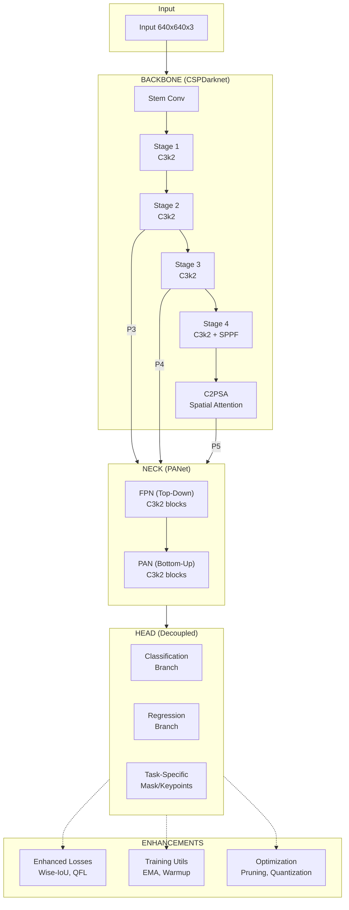

# YOLOv11 From Scratch

A complete PyTorch implementation of YOLOv11 object detection from scratch, with additional enhancements for training, optimization, and deployment.

## Supported Tasks

- **Detection** - Object detection (80 COCO classes)
- **Segmentation** - Instance segmentation
- **Pose Estimation** - Human keypoint detection (17 COCO keypoints)

## Project Structure

```
YOLO/
├── yolov11/
│   ├── __init__.py              # Package exports
│   ├── blocks.py                # C3k2, C2PSA, SPPF, Attention, DFL
│   ├── backbone.py              # CSPDarknet + C2PSA attention
│   ├── neck.py                  # PANet with C3k2 blocks
│   ├── head.py                  # Detection/Segmentation/Pose heads
│   ├── model.py                 # YOLOv11 model class
│   │
│   ├── losses/
│   │   ├── box_loss.py          # CIoU, DFL losses
│   │   ├── cls_loss.py          # BCE, Focal losses
│   │   ├── combined_loss.py     # Task-Aligned Assigner
│   │   └── enhanced_loss.py     # Wise-IoU, Quality Focal Loss
│   │
│   ├── data/
│   │   ├── dataset.py           # COCO/YOLO loaders
│   │   └── augmentations.py     # Mosaic, MixUp, CutMix
│   │
│   └── utils/
│       ├── training.py          # EMA, schedulers
│       ├── pruning.py           # Model compression
│       └── export.py            # ONNX, TensorRT, quantization
│
├── train_quick.py               # Quick training script
├── train.py                     # Full training script
└── inference.py                 # Inference script
```

## Installation

```bash
pip install -r requirements.txt
```

## Quick Start

```python
from yolov11 import YOLOv11

# Create model
model = YOLOv11(num_classes=80, task='detect', model_size='s')

# Forward pass
import torch
x = torch.randn(1, 3, 640, 640)
outputs = model(x)
```

```bash
# Quick training on COCO subset
python train_quick.py
```

## Architecture



## Comparison: YOLOv11 vs This Implementation

| Feature | Standard YOLOv11 | This Implementation |
|---------|------------------|---------------------|
| **Architecture** | | |
| CSP Block | C3k2 | C3k2 |
| Spatial Attention | C2PSA | C2PSA |
| Neck | PANet | PANet with C3k2 |
| **Loss Functions** | | |
| Box Loss | CIoU + DFL | CIoU + DFL + Wise-IoU |
| Classification | BCE | BCE + Quality Focal Loss |
| Label Smoothing | No | Yes (configurable) |
| **Training** | | |
| EMA | Yes | Yes (ModelEMA) |
| Warmup | Linear | Linear + Cosine |
| Progressive Resize | No | Yes |
| Early Stopping | No | Yes |
| **Augmentation** | | |
| Mosaic | Yes | Yes |
| MixUp | Yes | Yes |
| CutMix | No | Yes |
| CopyPaste | Limited | Yes |
| **Optimization** | | |
| Pruning | No | Structured/Unstructured/Global |
| ONNX Export | Yes | Yes |
| TensorRT | Separate | Integrated (optional) |
| INT8 Quantization | Separate | Integrated (optional) |

## Model Variants

| Model | Parameters | FLOPs | mAP (COCO) |
|-------|------------|-------|------------|
| YOLOv11n | 5.3M | 6.5G | ~39.5 |
| YOLOv11s | 21.0M | 28G | ~47.0 |
| YOLOv11m | 26M | 79G | ~51.5 |
| YOLOv11l | 44M | 165G | ~53.4 |
| YOLOv11x | 68M | 258G | ~54.7 |

## Key Components

### Building Blocks

| Block | Description |
|-------|-------------|
| C3k2 | Faster CSP bottleneck (replaces C2f) |
| C2PSA | Cross Stage Partial with Spatial Attention |
| Attention | Multi-head self-attention module |
| SPPF | Spatial Pyramid Pooling Fast |
| DFL | Distribution Focal Loss head |

### Training Enhancements

```python
from yolov11.utils import ModelEMA, ProgressiveResizing

# EMA for stable weights
ema = ModelEMA(model, decay=0.9999)

# Progressive image sizing
resizer = ProgressiveResizing(start_size=320, end_size=640)
```

### Model Optimization

```python
from yolov11.utils import global_pruning, export_onnx

# Prune 30% of weights
pruned = global_pruning(model, amount=0.3)

# Export to ONNX
export_onnx(model, "model.onnx")
```

## Training

### Quick Training (COCO subset)

```bash
python train_quick.py
```

Configuration in `train_quick.py`:

```python
CONFIG = {
    'model_size': 'n',        # n, s, m, l, x
    'epochs': 20,
    'batch_size': 8,
    'use_ema': True,
    'warmup_epochs': 3,
    'early_stopping': 10,
}
```

### Full Training

```bash
python train.py --task detect --model s --data /path/to/images \
    --ann annotations.json --epochs 100 --batch 16
```

## Inference

```bash
# Image
python inference.py --weights best.pt --source image.jpg

# Video
python inference.py --weights best.pt --source video.mp4

# Webcam
python inference.py --weights best.pt --source 0
```

## License

MIT License
