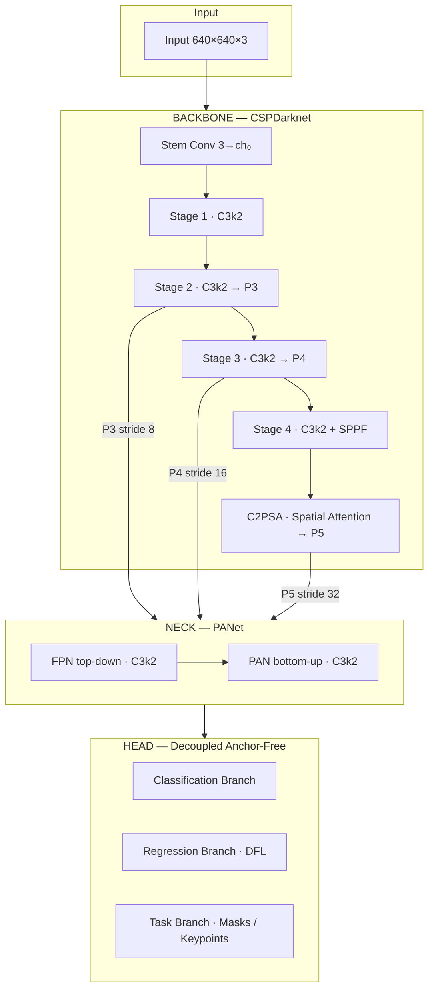

# YOLOv11 — From Scratch in PyTorch

> A complete, research-grade implementation of **YOLOv11** with addons,  built entirely from scratch in PyTorch.  
> Supports **detection**, **instance segmentation**, and **pose estimation** in a single unified codebase.

---

## 🎬 Demo

### Video Inference (with object tracking)

<video src="output.mp4" controls width="100%"></video>

> *Real-time detection with FPS overlay and SimpleTracker smoothing.*  
> Run with: `python inference.py --weights saves/last.pt --source film.mp4 --save output.mp4`

---

### Image Inference


> *11 detections on a COCO val image — persons, baseball bats, baseball glove, chair.*  
> Run with: `python inference.py --weights saves/last.pt --source image.jpg --save output.jpg --half`

---

## ✨ Features

| Category | Feature |
|----------|---------|
| **Architecture** | C3k2 efficient CSP blocks, C2PSA spatial attention, PANet neck |
| **Tasks** | Object detection · Instance segmentation · Pose estimation (17 kpts) |
| **Loss** | CIoU + DFL + Wise-IoU · Quality Focal Loss · Dice + BCE for masks |
| **Training** | EMA · Linear warmup · Cosine annealing · Progressive resizing · Early stopping |
| **Augmentation** | Mosaic · MixUp · CutMix · CopyPaste · RandomHSV · RandomFlip |
| **Inference** | FP16 · ONNX · TensorRT · Webcam · Video with tracking |
| **Optimization** | Structured / unstructured / global pruning · INT8 quantization |

---

## 📁 Project Structure

```
YOLO/
├── yolov11/
│   ├── __init__.py              # Package exports
│   ├── blocks.py                # C3k2, C2PSA, SPPF, Attention, DFL
│   ├── backbone.py              # CSPDarknet backbone
│   ├── neck.py                  # PANet (FPN + PAN) with C3k2
│   ├── head.py                  # Detection / Segmentation / Pose heads
│   ├── model.py                 # YOLOv11 unified model + BN fusion
│   │
│   ├── losses/
│   │   ├── combined_loss.py     # TaskAlignedAssigner + YOLOv11Loss
│   │   ├── box_loss.py          # CIoU, DFL losses
│   │   ├── cls_loss.py          # BCE, Focal losses
│   │   ├── enhanced_loss.py     # Wise-IoU, Quality Focal Loss
│   │   ├── seg_loss.py          # Dice + BCE for segmentation
│   │   └── pose_loss.py         # OKS + L1 + visibility for pose
│   │
│   ├── data/
│   │   ├── dataset.py           # COCO JSON + YOLO TXT loaders
│   │   └── augmentations.py     # Mosaic, MixUp, LetterBox, HSV
│   │
│   └── utils/
│       ├── training.py          # ModelEMA, WarmupScheduler, EarlyStopping
│       ├── metrics.py           # mAP50, mAP50-95, OKS, ConfusionMatrix
│       ├── nms.py               # Batched NMS (torchvision-accelerated)
│       ├── visualization.py     # Draw boxes / masks / keypoints
│       ├── export.py            # ONNX + TensorRT + INT8 quantization
│       ├── pruning.py           # Model compression utilities
│       └── tracker.py           # SimpleTracker (IoU-based)
│
├── train.py                     # Full distributed training script
├── train_quick.py               # Quick training (COCO subset)
├── inference.py                 # Image / video / webcam inference
├── evaluate.py                  # COCO mAP evaluation
├── export_yolo.py               # Export helper script
└── requirements.txt
```

---

## 🚀 Installation

```bash
# Clone the repository
git clone https://github.com/your-username/yolov11.git
cd yolov11

# Install dependencies
pip install -r requirements.txt
```

**Requirements:**

```
torch>=2.0.0
torchvision>=0.15.0
numpy>=1.24.0
opencv-python>=4.8.0
matplotlib>=3.7.0
pillow>=10.0.0
pyyaml>=6.0
tqdm>=4.65.0
pycocotools>=2.0.6
```

**Optional (for export):**

```bash
pip install onnx onnxruntime onnx-simplifier   # ONNX export
pip install tensorrt pycuda                     # TensorRT (NVIDIA only)
```

---

## 🏗️ Architecture



## 📊 Validation Results

### COCO val2017 (5000 images)

*Model **YOLOv11s** trained on 110k photos for **150 epochs** on an **NVIDIA H100** GPU. Results validated using `saves/last.pt` on COCO val2017.*

```text
 Average Precision  (AP) @[ IoU=0.50:0.95 | area=   all | maxDets=100 ] = 0.299
 Average Precision  (AP) @[ IoU=0.50      | area=   all | maxDets=100 ] = 0.456      
 Average Precision  (AP) @[ IoU=0.75      | area=   all | maxDets=100 ] = 0.317      
 Average Precision  (AP) @[ IoU=0.50:0.95 | area= small | maxDets=100 ] = 0.143      
 Average Precision  (AP) @[ IoU=0.50:0.95 | area=medium | maxDets=100 ] = 0.324      
 Average Precision  (AP) @[ IoU=0.50:0.95 | area= large | maxDets=100 ] = 0.405      
 Average Recall     (AR) @[ IoU=0.50:0.95 | area=   all | maxDets=  1 ] = 0.277      
 Average Recall     (AR) @[ IoU=0.50:0.95 | area=   all | maxDets= 10 ] = 0.463      
 Average Recall     (AR) @[ IoU=0.50:0.95 | area=   all | maxDets=100 ] = 0.494      
 Average Recall     (AR) @[ IoU=0.50:0.95 | area= small | maxDets=100 ] = 0.261      
 Average Recall     (AR) @[ IoU=0.50:0.95 | area=medium | maxDets=100 ] = 0.546      
 Average Recall     (AR) @[ IoU=0.50:0.95 | area= large | maxDets=100 ] = 0.660      

==================================================
Results:
  mAP50-95: 0.2993
  mAP50:    0.4555
  mAP75:    0.3172
  mAP (S):  0.1428
  mAP (M):  0.3243
  mAP (L):  0.4055
==================================================
```

---

## 🎯 Inference

### Image

```bash
python inference.py \
    --weights saves/last.pt \
    --source path/to/image.jpg \
    --save output.jpg \
    --conf 0.25 \
    --iou 0.45
```

### Video

```bash
python inference.py \
    --weights saves/last.pt \
    --source path/to/video.mp4 \
    --save output.mp4
```

### Webcam

```bash
python inference.py --weights saves/last.pt --source 0
```

### DroidCam (phone as webcam)

```bash
python inference.py --weights saves/last.pt --droidcam
```

### FP16 (faster on GPU)

```bash
python inference.py --weights saves/last.pt --source image.jpg --half
```

### Disable tracking (raw detections)

```bash
python inference.py --weights saves/last.pt --source video.mp4 --no-track
```

### Full CLI Reference

| Argument | Default | Description |
|----------|---------|-------------|
| `--weights` | *required* | Path to `.pt`, `.onnx`, or `.engine` |
| `--source` | *required* | Image path, video path, or webcam index (`0`) |
| `--task` | `detect` | `detect` · `segment` · `pose` |
| `--conf` | `0.25` | Confidence threshold |
| `--iou` | `0.45` | NMS IoU threshold |
| `--img-size` | `640` | Input resolution |
| `--device` | `0` | GPU index or `cpu` |
| `--save` | `None` | Output path (auto-detects image/video) |
| `--half` | `False` | FP16 inference (GPU only) |
| `--no-track` | `False` | Disable IoU-based object tracking |
| `--droidcam` | `False` | Use DroidCam stream |

### Python API

```python
from yolov11 import YOLOv11
import torch

# Load model
model = YOLOv11(num_classes=80, task='detect', model_size='s')
model.load_state_dict(torch.load('saves/last.pt')['ema_state_dict'])
model.eval().fuse()  # fuse Conv+BN for ~10% speedup

# Run inference
x = torch.randn(1, 3, 640, 640)
with torch.no_grad():
    outputs = model(x)
# outputs['cls']  → list of 3 tensors (one per scale)
# outputs['reg']  → list of 3 tensors
```

---

## 🏋️ Training

### Quick Training (COCO mini subset)

```bash
python train_quick.py
```

Edit the config at the top of `train_quick.py`:

```python
CONFIG = {
    'model_size': 'n',        # n | s | m | l | x
    'epochs': 20,
    'batch_size': 8,
    'use_ema': True,
    'warmup_epochs': 3,
    'early_stopping': 10,
}
```

### Full Training

```bash
python train.py \
    --task detect \
    --model s \
    --data /path/to/images \
    --ann /path/to/train_annotations.json \
    --val-ann /path/to/val_annotations.json \
    --epochs 100 \
    --batch 16 \
    --img-size 640 \
    --lr 0.01 \
    --num-classes 80 \
    --save-dir runs/train
```

### Distributed Training (multi-GPU)

```bash
torchrun --nproc_per_node=4 train.py \
    --task detect \
    --model s \
    --data /path/to/images \
    --ann annotations.json \
    --batch 64 \
    --epochs 100
```

### Training CLI Reference

| Argument | Default | Description |
|----------|---------|-------------|
| `--task` | `detect` | `detect` · `segment` · `pose` |
| `--model` | `s` | Model size: `n` · `s` · `m` · `l` · `x` |
| `--data` | *required* | Root directory of images |
| `--ann` | `None` | COCO JSON annotations (train) |
| `--val-ann` | `None` | COCO JSON annotations (val) |
| `--epochs` | `100` | Number of training epochs |
| `--batch` | `16` | Total batch size |
| `--img-size` | `640` | Training image resolution |
| `--lr` | `0.01` | Initial learning rate |
| `--workers` | `4` | DataLoader worker threads |
| `--device` | `0` | GPU index or `cpu` |
| `--resume` | `None` | Resume from checkpoint path |
| `--save-dir` | `runs/train` | Output directory |
| `--num-classes` | `80` | Number of object classes |
| `--compile` | `False` | `torch.compile` (PyTorch 2.0+) |
| `--ema-decay` | `0.9999` | EMA decay factor |
| `--warmup-epochs` | `3` | Linear LR warmup epochs |
| `--label-smoothing` | `0.0` | Classification label smoothing |
| `--use-cbam` | `False` | Enable CBAM attention in backbone |

### Resume from Checkpoint

```bash
python train.py --resume runs/train/last.pt --epochs 200
```

---

## 📦 Export

### ONNX

```bash
python export_yolo.py --weights saves/last.pt --format onnx
```

```python
from yolov11.utils.export import export_onnx
export_onnx(model, 'model.onnx', simplify=True)
```

### TensorRT (FP16)

```python
from yolov11.utils.export import export_tensorrt
export_tensorrt('model.onnx', 'model', fp16=True)
```

### INT8 Quantization

```python
from yolov11.utils.export import quantize_dynamic, quantize_static

# Dynamic quantization (CPU, no calibration data needed)
quantized = quantize_dynamic(model)

# Static quantization (requires calibration DataLoader)
quantized = quantize_static(model, calibration_loader)
```

---

## 🔬 Advanced Features

### Model EMA

```python
from yolov11.utils.training import ModelEMA

ema = ModelEMA(model, decay=0.9999)
# After each optimizer step:
ema.update(model)
# Use ema.ema for evaluation
```

### Progressive Resizing

```python
from yolov11.utils.training import ProgressiveResizing

resizer = ProgressiveResizing(start_size=320, end_size=640, num_epochs=100)
current_size = resizer.get_size(epoch=50)  # → 480
```

### Model Pruning

```python
from yolov11.utils import global_pruning

# Remove 30% of least-important weights
pruned_model = global_pruning(model, amount=0.3)
```

### BN Fusion (inference speedup)

```python
model.eval()
model.fuse()  # Fuses Conv2d + BatchNorm2d → ~5-10% faster inference
```

---

## 📊 Comparison: This Implementation vs Standard YOLOv11

| Feature | Standard YOLOv11 | This Implementation |
|---------|-----------------|---------------------|
| **Architecture** | | |
| CSP Block | C3k2 | C3k2 |
| Spatial Attention | C2PSA | C2PSA |
| Neck | PANet | PANet with C3k2 |
| **Loss Functions** | | |
| Box Loss | CIoU + DFL | CIoU + DFL + Wise-IoU |
| Classification | BCE | BCE + Quality Focal Loss |
| Label Smoothing | No | ✅ Configurable |
| **Training** | | |
| EMA | ✅ | ✅ ModelEMA |
| Warmup | Linear | Linear + Cosine |
| Progressive Resize | No | ✅ |
| Early Stopping | No | ✅ |
| **Augmentation** | | |
| Mosaic | ✅ | ✅ |
| MixUp | ✅ | ✅ |
| CutMix | No | ✅ |
| CopyPaste | Limited | ✅ |
| **Deployment** | | |
| ONNX Export | ✅ | ✅ |
| TensorRT | Separate tool | ✅ Integrated |
| INT8 Quantization | Separate tool | ✅ Integrated |
| Pruning | No | ✅ 3 modes |
| Object Tracking | No | ✅ SimpleTracker |

---

## 📄 License

MIT License — free to use, modify, and distribute.
